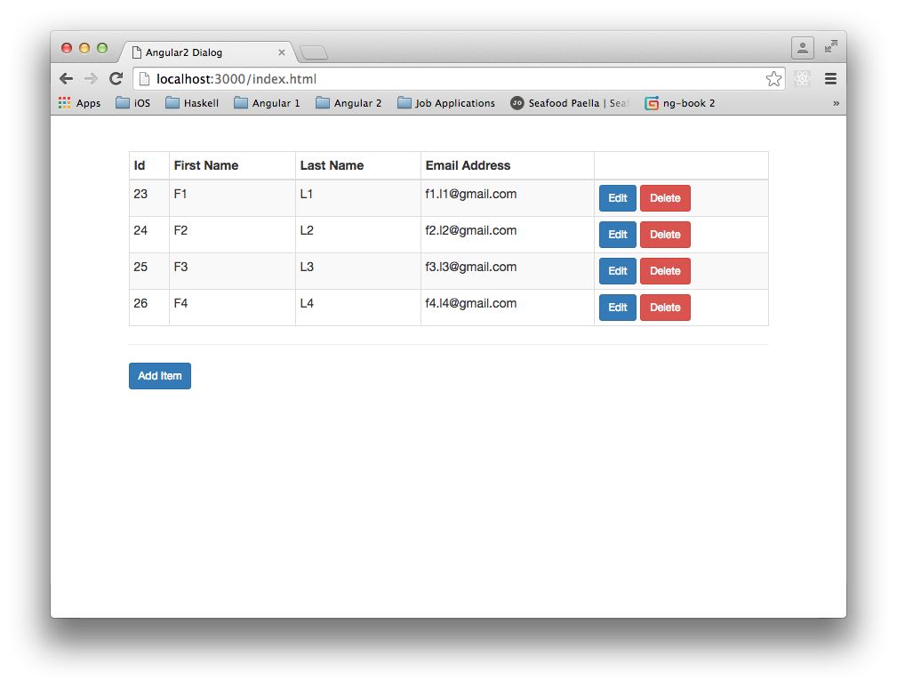
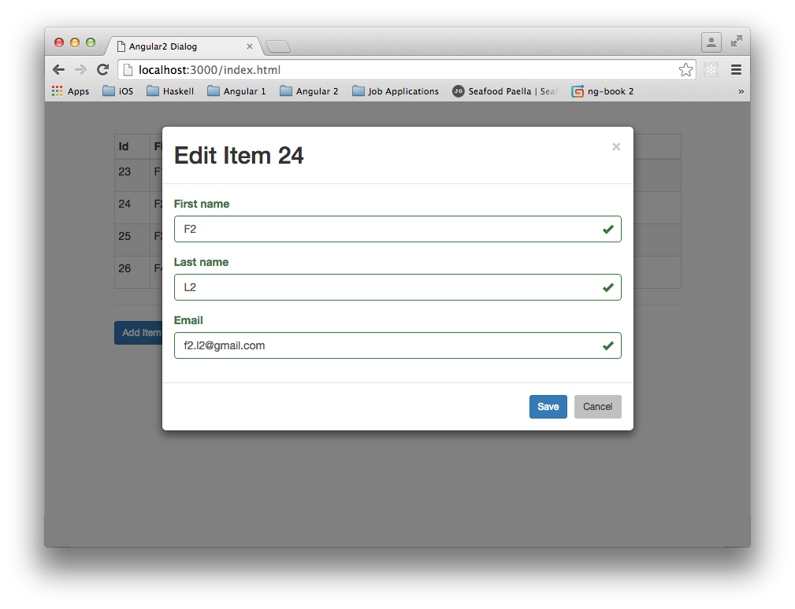
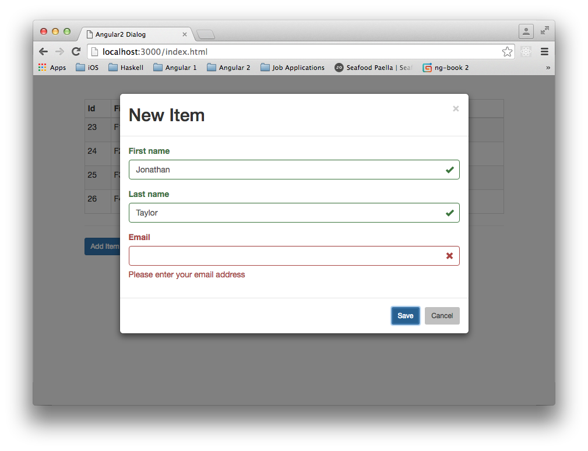

## Description

This is a little Angular 2+ app that demonstrates a form with validation inside an ng-bootstrap modal dialog.
It is an update of my earlier Angular 1.x [AngularDialog](https://github.com/taylorjg/AngularDialog) repo.

A few things are different (other than the switch from Angular 1.x to Angular 2+):

* Use of Visual Studio Code instead of Visual Studio 2015.
* Use of Node.js/Express backend instead of IIS/ASP.NET MVC.

## Try it out

The application is deployed on [Heroku](https://www.heroku.com/):

* https://angular2dialog.herokuapp.com/
    * _NOTE: Heroku spins down the instance after a period of inactivity. It takes around 10s to reactivate_

## Future Plans

* Add pagination functionality.
* Add searching functionality.
* Add frontend unit tests.
* Add backend unit tests.
* Add e2e (Protractor) tests (with mocked RESTful API).
* ~~Add real backend persistence (currently in-memory only). I will probably use Postgres for this.~~
    * _In the end, I used Redis instead_
* ~~Make the API more RESTful by adding hypermedia links.~~
    * ~~Change the frontend to make use of these hypermedia links.~~

## Screenshots

## Links

* [angular](https://angular.io/)
* [ng-bootstrap](https://ng-bootstrap.github.io)
* [Heroku Node.js Support](https://devcenter.heroku.com/articles/nodejs-support)
